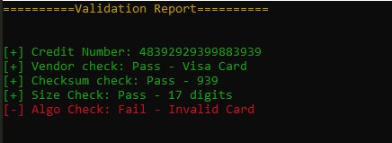

<h3 align ="center"> Credit Card Validation</h3>

To validate the card the console app requires the user to enter the debit card number and; 

<ul>
	<li>checks for the card vendor</li>
	<li>length of card number digits</li>
	<li>extracts a checksum</li>
	<li>implements a simple boolean check</li>
</ul>

 and returns the corresponding flags

<h3 align ="center">Sample Output Screen</h3>

